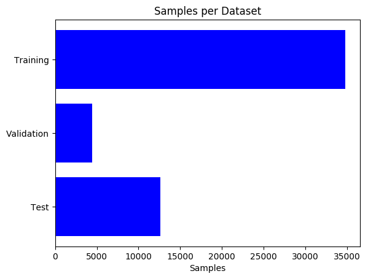
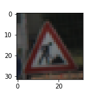
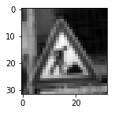
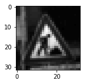
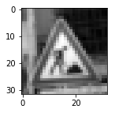
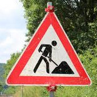
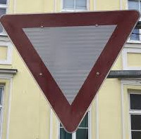
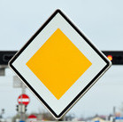
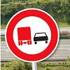
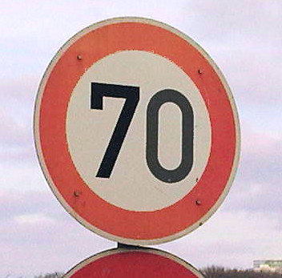

# Build a Traffic Sign Recognition Project

The goals / steps of this project are the following:
* Load the data set (see below for links to the project data set)
* Explore, summarize and visualize the data set
* Design, train and test a model architecture
* Use the model to make predictions on new images
* Analyze the softmax probabilities of the new images
* Summarize the results with a written report

### Writeup / README

####  1. Provide a Writeup / README that includes all the rubric points and how you addressed each one. 

You're reading it! and here is a link to my [project code](https://github.com/stein089/CarND-Traffic-Sign-Classifier-Project/blob/master/Traffic_Sign_Classifier.ipynb)

### Data Set Summary & Exploration

#### 1. Provide a basic summary of the data set. 

* The size of training set is 34799 samples
* The size of the validation set is 4410 samples
* The size of test set is 12630 samples
* The shape of a traffic sign image is (32, 32, 3)
* The number of unique classes/labels in the data set is 43

#### 2. Include an exploratory visualization of the dataset.

Here is an exploratory visualization of the data set. 

And this image is a random sample of the training set with its corresponding label (25,Road work):

### Design and Test a Model Architecture

#### 1. Describe how you preprocessed the image data. 

The preprocessing is divided into three steps
1. Convert to Grayscale: To limit the input channels to one and to be independent of colors. 
2. Extend Training set with two gamma-corrections (0.5, 2) of grayscale-training-set. This results in a new training size of three times the original stated training size (3*34799 = 104397)
3. Normalize values to the range between -1 and 1, in order to have zero mean and a small variance

The following images show a random input image, the converted grayscale image, and the grayscale image with gamma=2 and gamma=0.5

   

#### 2. Describe what your final model architecture looks like including model type, layers, layer sizes, connectivity, etc.) 

Consider including a diagram and/or table describing the final model.

My final model is very similar to the LeNet network and consists of the following layers:

| Layer         		    |     Description	        					            | 
|:---------------------:|:---------------------------------------------:| 
| Input         		    | 32x32x1 Grayscale image   							      | 
| Convolution 5x5     	| 1x1 stride, same padding, outputs 28x28x6 	  |
| RELU					        |												                        |
| Max pooling	      	  | 2x2 stride,  outputs 14x14x6 				          |
| Convolution 5x5     	| 1x1 stride, same padding, outputs 10x10x16 	  |
| RELU					        |												                        |
| Max pooling	      	  | 2x2 stride,  outputs 5x5x6 				            |
| Flatten      	        | 2x2 stride,  outputs 400				            	|
| Fully connected		    | outputs 120        									          |
| RELU					        |												                        |
| Dropout					      |	keep_prob = 0.8                               |
| Fully connected		    | outputs 84        									          |
| RELU					        |												                        |
| Dropout					      |	keep_prob = 0.8                               |
| Fully connected		    | outputs 43        									          |
 
 
#### 3. Describe how you trained your model. 

To train the model, I used an AdamOptimizer as seen in the LeNet appraoch. 
A training rate of 0.0005,  batch size of 100, and 50 epochs

#### 4. Describe the approach taken for finding a solution and getting the validation set accuracy to be at least 0.93. 

I tried the following methods (compared to the LeNet approach) to obtain more than 93% accuracy:
* Increased the epochs 
* Lowered the training rate
* Lowered the batch size
* Added dropout layers in order to avoid overfitting
* augmented the training set, using different gamma values in order to be more robust to brightness variations.

The fine tuning of the parameters was done with AWS in order to speed up the process.

My final model results were:
* training set accuracy of 99.3%
* validation set accuracy of 94.9% 
* test set accuracy of 93.1%

###Test a Model on New Images

####1. Choose five German traffic signs found on the web and provide them in the report. 

Here are five German traffic signs that I found on the web:

    

All images should be pretty easy to classify, since they are cropped to the sign exaclty and also clearly visible in the images. 

#### 2. Discuss the model's predictions on these new traffic signs and compare the results to predicting on the test set.

Here are the results of the prediction:

| Image			            |     Prediction	        					            | 
|:---------------------:|:---------------------------------------------:| 
| Road work       		  | Road work    									          | 
| Yield     			      | Yield 										          |
| Priority road					| Priority road											          |
| No passing for vehicles over 3.5 metric tons | No passing for vehicles over 3.5 metric tons	|
| Speed limit (70km/h)	| Speed limit (70km/h)    							    |

The model was able to correctly guess 5 of the 5 traffic signs, which gives an accuracy of 100%. This compares favorably to the accuracy on the test set of 93.1%.

#### 3. Describe how certain the model is when predicting on each of the five new images by looking at the softmax probabilities for each prediction. 

The model is very certain when predicting the images as seen in the following tables. The corresponding label reaches almost 100% in each case.

|Test image 1 | Probability (%) |
|:-------------:|:--------------------:|
|Road work |100.000 |
|Beware of ice/snow |0.000 |
|General caution |0.000 |
|Pedestrians |0.000 |
|Right-of-way at the next intersection |0.000 |

|Test image 2 | Probability (%) |
|:-------------:|:--------------------:|
|Yield |100.000 |
|No passing |0.000 |
|Speed limit (20km/h) |0.000 |
|Speed limit (30km/h) |0.000 |
|Speed limit (50km/h) |0.000 |

|Test image 3 | Probability (%) |
|:-------------:|:--------------------:|
|Priority road |100.000 |
|Speed limit (20km/h) |0.000 |
|Speed limit (30km/h) |0.000 |
|Speed limit (50km/h) |0.000 |
|Speed limit (60km/h) |0.000 |

|Test image 4 | Probability (%) |
|:-------------:|:--------------------:|
|No passing for vehicles over 3.5 metric tons |100.000 |
|Slippery road |0.000 |
|No passing |0.000 |
|Speed limit (20km/h) |0.000 |
|Speed limit (30km/h) |0.000 |

|Test image 5 | Probability (%) |
|:-------------:|:--------------------:|
|Speed limit (70km/h) |99.914 |
|General caution |0.086 |
|Speed limit (30km/h) |0.000 |
|Speed limit (20km/h) |0.000 |
|Road narrows on the right |0.000 |
